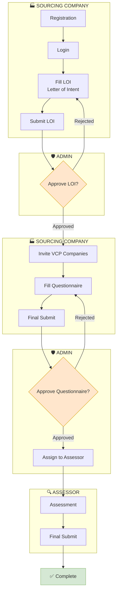
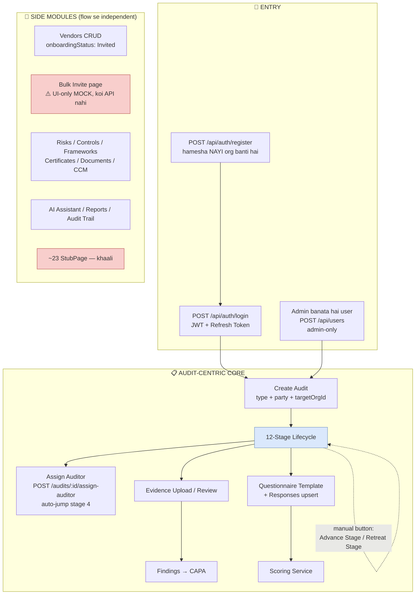
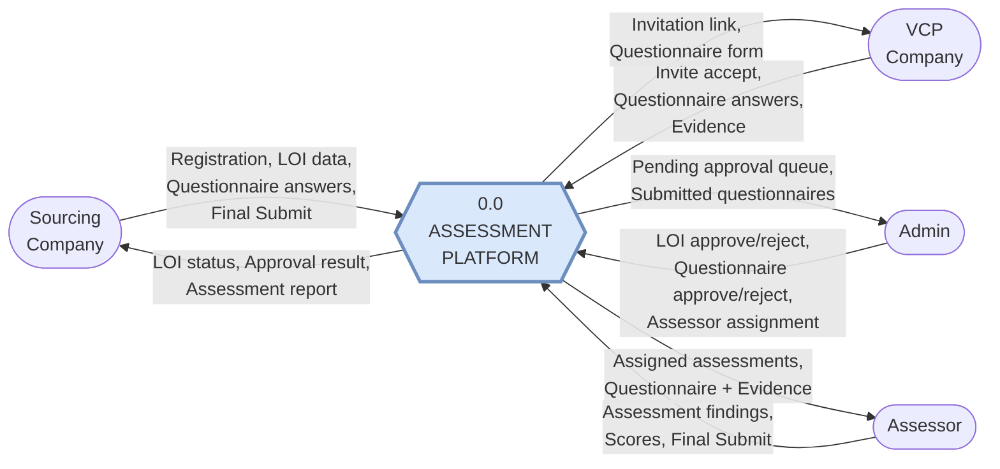
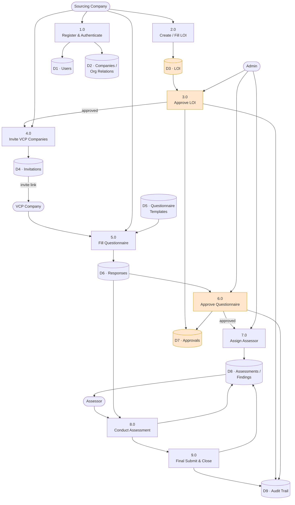
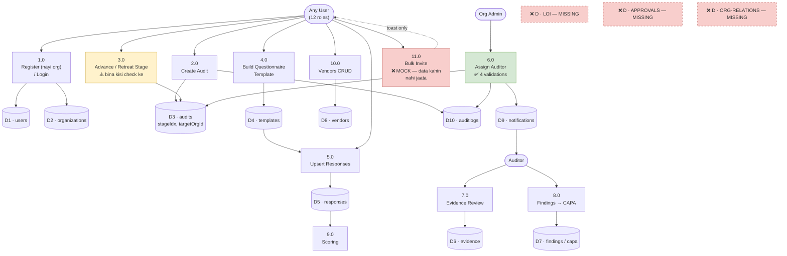
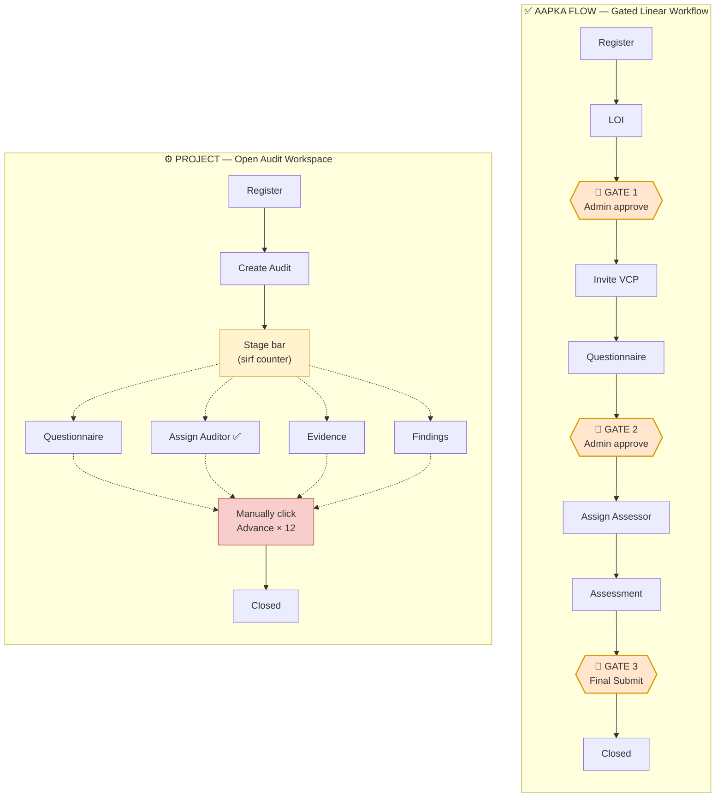
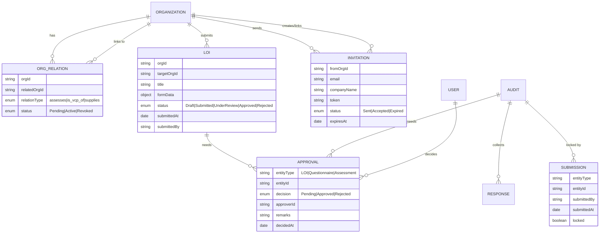
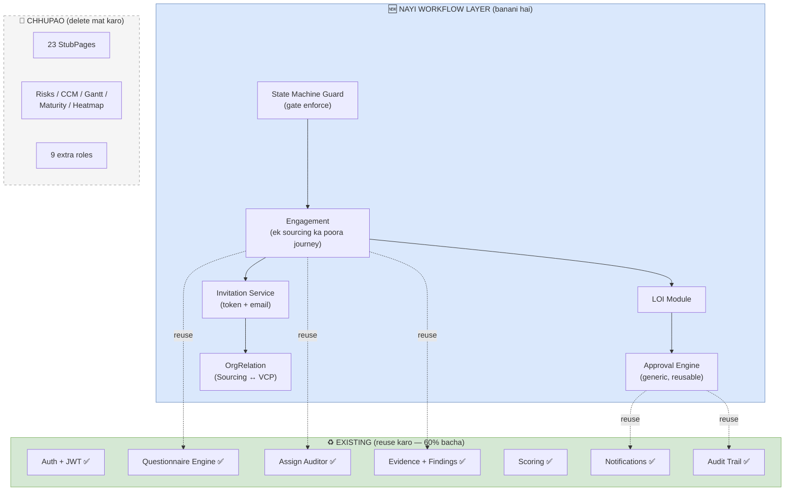
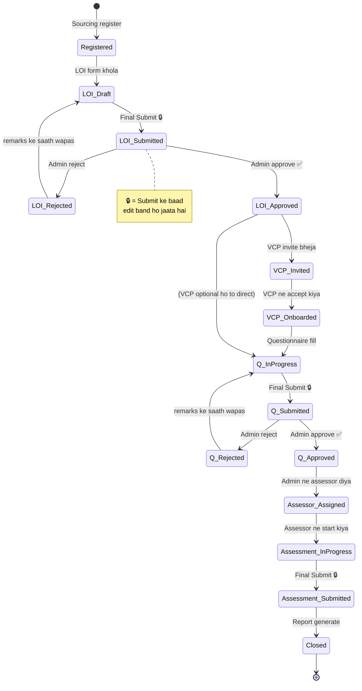

# Flow Comparison — Expected Flow (Aapka) vs Built Project (Vendor Passport)

> **Date:** 2026-08-10
> **Scope:** Aapke diye hue 3-role flow (Sourcing → Admin → Assessor) ko project ke actual code ke saath line-by-line compare kiya gaya hai.
> **Method:** Sirf docs nahi — actual code padha gaya (models, routes, services, React pages).

---

## 0. Ek Line Ka Jawab

**Haan, kaafi alag hai — lekin "galat" nahi, "alag shape" ka hai.**

Aapka flow ek **linear, gated, cross-company workflow** hai (LOI → approve → invite → questionnaire → approve → assign → assess → submit).
Project ek **generic single-tenant GRC Audit Platform** bana hai (12-stage audit lifecycle + 20+ compliance modules), jisme:

- **Building blocks ~50% maujood hain** (auth, questionnaire engine, assign-auditor, evidence, findings, scoring)
- **Workflow ki reedh ki haddi (spine) 0% hai** — LOI, Approval gates, Final Submit, aur cross-company data flow **bilkul nahi hai**
- **Breadth me over-built hai** — ~23 aise pages hain jo abhi khaali `StubPage` hain, aur bahut se module aapke flow me hain hi nahi

**Overall functional match: ~45%**

---

## 1. Aapka Expected Flow (Flow A)



**Flow A ki 4 core properties:**
1. **Linear state machine** — har step ka ek hi next step hai
2. **Approval gates** — Admin ke bina aage nahi badh sakte (hard stop)
3. **Cross-company** — Sourcing company doosri company (VCP) ko invite karti hai, dono ka data ek hi assessment me
4. **Explicit Final Submit** — har role ka ek "ab main done hoon, lock kar do" moment

---

## 2. Project Ka Actual Flow (Flow B)



### Project ki 12-Stage Audit Lifecycle
`backend/modules/audits/audit.service.js:8`

```
Planning → Scoping → Risk Assessment → Questionnaire → Auditor Assigned →
Execution → Evidence Review → Findings → Corrective Actions →
Verification → Report → Closed
```

⚠️ **Yeh stages sirf ek counter (`stageIdx`) hain.** Koi bhi stage aage badhne ke liye **koi condition check nahi hoti** — sirf "Advance Stage" button dabao aur `stageIdx += 1`. Matlab ye **workflow nahi, ek progress bar hai**.

---

## 3. Step-by-Step Comparison Table

| # | Aapka Step | Project me kya hai | Kahan hai (code) | Match | Verdict |
|---|-----------|-------------------|-----------------|-------|---------|
| 1 | **Sourcing Company Registration** | `POST /api/auth/register` hai — par **hamesha nayi org banati hai**. Org type enum me `Sourcing Company` hai hi nahi (sirf Own Organization/Supplier/Vendor/Partner/Client) | `auth.service.js:11-46`, `org.model.js:6` | 🟡 **60%** | Kaam karta hai, par "Sourcing Company" concept missing |
| 2 | **Login** | Pura JWT + refresh token + Redis blacklist + rate limit. Aapke flow se **zyada strong** | `auth.service.js:52-118` | 🟢 **100%** | ✅ Done |
| 3 | **Fill LOI** | **Kuch bhi nahi.** Na model, na route, na UI, na field. Poore codebase me `LOI` shabd hi nahi hai | — | 🔴 **0%** | ❌ Missing |
| 4 | **Invite to VCP Companies** | `/bulk-invite` page hai lekin **pura fake hai** — `sendInvites()` sirf toast dikhata hai, koi API call nahi. Vendor model me `onboardingStatus: 'Invited'` hai par email/token/link kuch nahi. VCP khud register kare to **nayi alag org ban jayegi**, sourcing se judegi hi nahi | `BulkInvite.jsx:46-57`, `vendor.model.js:9` | 🔴 **20%** | ❌ Mock hai |
| 5 | **Fill Questionnaire** | Achha engine hai — 21 question types, sections, conditional logic (`dependsOn`), weight, evidence-required flag, scoring service, response upsert | `template.model.js`, `response.service.js`, `AuditQuestionnaireTab.jsx` | 🟢 **80%** | ✅ Sabse strong part |
| 6 | **Final Submit (Sourcing)** | **Nahi hai.** Har response ka apna status (`draft/submitted/reviewed/flagged/accepted`) hai, par "sab lock karo aur admin ko bhejo" jaisa **koi endpoint nahi** | `response.model.js:12` | 🔴 **25%** | ❌ Missing |
| 7 | **Admin: Approve LOI** | **Kuch nahi** (kyunki LOI hi nahi hai) | — | 🔴 **0%** | ❌ Missing |
| 8 | **Admin: Approve Questionnaire** | Sirf `flagResponse()` hai (ek response ko flag karo). **Approve/Reject endpoint nahi**, approver ka naam/date/remarks store nahi hota, poore questionnaire ka approval concept nahi | `response.service.js:40-48` | 🔴 **20%** | ❌ Adhoora |
| 9 | **Admin: Assign to Assessor** | ✅ **Yeh bahut achha bana hai.** `POST /api/audits/:id/assign-auditor` — 4 hard checks: (1) user real ho, (2) sahi role ho, (3) khud ko assign na kar sake, (4) jis org ka audit ho uska banda auditor na bane. Auto stage-4 + notification | `audit.service.js:109-162` | 🟢 **85%** | ✅ Sirf naam alag ("Auditor" vs "Assessor") |
| 10 | **Assessor: Assessment** | AuditorWorkspace, Evidence review, Findings, Controls, Working Papers, scoring — sab hai | `AuditorWorkspace.jsx`, `findings/`, `evidence/` | 🟡 **70%** | ✅ Tools hain, sequence nahi |
| 11 | **Assessor: Final Submit** | **Nahi hai.** Sirf manually "Advance Stage" dabate raho Report → Closed tak | `audit.service.js:63-72` | 🔴 **25%** | ❌ Missing |

### Match Summary

```
Registration + Login   ████████████████░░░░  80%
LOI (poora block)      ░░░░░░░░░░░░░░░░░░░░   0%
VCP Invite             ████░░░░░░░░░░░░░░░░  20%
Questionnaire          ████████████████░░░░  80%
Approval Gates         ████░░░░░░░░░░░░░░░░  10%
Assign to Assessor     █████████████████░░░  85%
Assessment             ██████████████░░░░░░  70%
Final Submit (dono)    █████░░░░░░░░░░░░░░░  25%
─────────────────────────────────────────────
OVERALL                █████████░░░░░░░░░░░  ~45%
```

---

## 4. DFD — Data Flow Diagram

### 4.1 DFD Level 0 (Context) — Aapka Flow



### 4.2 DFD Level 1 — Aapka Flow (Expected)



### 4.3 DFD Level 1 — Project ka Actual (Built)



### 4.4 Dono ka Side-by-Side (sabse important diagram)



> **Yahi core difference hai:**
> Aapka flow **"guided rails"** hai — user galat order me kuch kar hi nahi sakta.
> Project **"open toolbox"** hai — sab kuch kisi bhi order me kar sakte ho, koi rok nahi.

---

## 5. Role Mapping

| Aapka Role | Project ka closest role | Status | Note |
|-----------|------------------------|--------|------|
| **Sourcing Company** (user) | `External Company User` ya `Compliance Manager` | 🟡 Partial | Company-type ka koi concept nahi, sirf user role hai |
| **VCP Company** (user) | `External Company User` / `Vendor Manager` | 🟡 Partial | VCP ko sourcing se link karne ka koi tarika nahi |
| **Admin** | `Organization Admin` / `Super Admin` | 🟢 Match | Par approve karne ki koi power/screen nahi hai |
| **Assessor** | `Auditor` (+ `Audit Manager`, `CA / Consultant`) | 🟢 Match | Sirf naam alag |

Project me total **12 roles** hain:
`Super Admin, Organization Admin, Compliance Manager, Audit Manager, Auditor, Reviewer, Risk Manager, Document Manager, Vendor Manager, Employee, External Company User, CA / Consultant`
— `backend/shared/roles.js:11`

**Matlab: aapko 3 roles chahiye, project me 12 hain.** Ye 9 extra roles client ke liye confusion banayenge.

---

## 6. Jo EXTRA Bana Hai (aapke flow me nahi hai)

### 6.1 Poore Modules jo aapke flow se bahar hain

| Module | Kya karta hai | Aapke flow me zarurat? |
|--------|--------------|----------------------|
| **Risks + Risk Heatmap** | Risk register, likelihood × impact matrix | ❌ Nahi |
| **Controls + Control Testing** | Internal controls define + test karna | ⚠️ Shayad baad me |
| **Frameworks + Requirements** | ISO 27001 / SOC2 jaise standards ka structure | ✅ Kaam ka — questionnaire ko framework se map kar sakte ho |
| **CAPA** | Corrective & Preventive Action tracking | ⚠️ Assessment ke baad useful |
| **Certificates + Expiry Alerts** | Certificate expiry tracking | ⚠️ Optional |
| **Documents + Evidence** | File upload, versioning, approval status | ✅ Zaroori — questionnaire ke saath proof |
| **CCM** (Continuous Control Monitoring) | Live control metrics dashboard | ❌ Nahi |
| **AI Assistant (Claude)** | Natural language me data query karna | ➕ Bonus |
| **Reports + Scheduler** | Report generate + schedule | ✅ Kaam ka |
| **Audit Trail (auditlogs)** | Har action ka log | ✅ **Bahut zaroori** — approval flow me compliance ke liye must |
| **Notifications** | In-app notification | ✅ Zaroori — invite/approval ke liye |
| **Gantt / Calendar** | Timeline view | ❌ Nahi |
| **Maturity Model / Gap Analysis** | Maturity scoring | ❌ Nahi |
| **Vendor Scorecard** | Vendor performance score | ⚠️ Optional |

### 6.2 ~23 Khaali Pages (StubPage)

Ye pages sidebar me dikhte hain par **andar kuch nahi hai** — click karo to "Coming soon" type screen:

```
audit-program, q-scoring, sampling-engine, self-assessment, mgmt-response,
traceability, issues, exceptions, framework-diff, exchange, esg,
risk-scheduler, sla-dashboard, audit-cost, org-compare, org-hierarchy,
three-lines, competency, doc-versions, perm-matrix, role-dashboard,
api-integrations, my-passport
```

— `frontend-react/src/App.jsx`

⚠️ **Demo me client ko ye dikhega aur wo confuse hoga** ki "itna sab bana hai par khulta kuch nahi".

### 6.3 12-Stage Lifecycle vs Aapke 3 Steps

Aapko chahiye: **LOI → Questionnaire → Assessment** (3 phases)
Project deta hai: **12 stages** — jinme se 7 aapke flow me matlab hi nahi rakhte (Scoping, Risk Assessment, Corrective Actions, Verification, etc.)

---

## 7. Jo MISSING Hai (banana padega)

| # | Missing cheez | Kyun zaroori | Effort |
|---|--------------|-------------|--------|
| 1 | **LOI model + API + UI** | Aapke flow ka pehla business document. Abhi zero hai | 🔴 Bada (3-4 din) |
| 2 | **Approval engine** (generic) | LOI approve, Questionnaire approve, Assessment approve — teeno ke liye ek reusable system | 🔴 Bada (3-4 din) |
| 3 | **Org relationship** (Sourcing ↔ VCP) | Abhi har company alag island hai. Sourcing apne VCP ka data dekh hi nahi sakta | 🔴 Bada (3-4 din) |
| 4 | **Real invitation system** | Token, email link, accept flow, invited user ka sahi org me landing. Abhi sirf toast hai | 🟡 Medium (2-3 din) |
| 5 | **Final Submit / lock** | Submit ke baad edit band ho jaye, status change ho, notification jaye | 🟡 Medium (2 din) |
| 6 | **Cross-org read visibility** | `targetOrgId` field model me hai par **kisi query me use hi nahi hota** — ye poora multi-company concept dead hai | 🟡 Medium (2 din) |
| 7 | **Guarded stage transitions** | Abhi "Advance Stage" bina kisi check ke chalta hai. Gate lagane padenge | 🟢 Chhota (1 din) |
| 8 | **"Assessor" role naming** | Ya to naya role add karo, ya `Auditor` ko UI me "Assessor" dikhao | 🟢 Chhota (2 ghante) |
| 9 | **Admin approval dashboard** | Admin ko "pending approvals" ki ek queue chahiye | 🟡 Medium (2 din) |

---

## 8. Data Model Gap

### Abhi jo collections hain
```
users · organizations · audits · templates · responses · evidence ·
findings · capa · risks · controls · frameworks · requirements ·
certificates · documents · vendors · comments · notifications · auditlogs
```

### Jo banane padenge



**Organization model me ye changes:**
```js
// abhi
type: enum ['Own Organization','Supplier','Vendor','Partner','Client']

// chahiye
type: enum ['Main Company (Assessor)','Sourcing Company','VCP',
            'Own Organization','Supplier','Vendor','Partner','Client']
parentOrgId: String   // VCP → Sourcing ka link
```

---

## 9. ⚠️ 3 Serious Issues jo abhi code me hain

Ye workflow se alag hain par **demo/production se pehle fix zaroori** hain:

### Issue 1 — Demo auth fallback ✅ FIXED

> **Correction.** Is file ke pehle version me maine ise "CRITICAL — bina token ke har API chal jaati hai" likha tha. **Wo galat tha**, aur maine wo baat kai baar dohrai. Neeche sahi baat hai.

`server.js` har bina-token request ko ek identity de deta tha (`Compliance Manager @ ORG-101`).

**Ye security hole nahi tha.** Har router `authenticate` lagata hai, jo iske baad chalta hai aur ya to verified JWT se `req.user` replace karta hai ya 401 deta hai — fallback kabhi kisi handler tak pahunchta hi nahi tha. Live test me `/api/questionnaires`, `/api/questionnaire-submissions`, `/api/assessments/templates`, `/api/audits` — chaaron 401 dete hain.

Do "unguarded" sub-routers bhi mile the (`template.routes.js`, `response.routes.js`), par wo ek parent ke andar mount hain jo pehle `authenticate` lagata hai.

Par problem asli thi — **padhne me** wo hole jaisa lagta tha (jaisa is file ke pehle version ne maan liya), aur ek galti door tha: koi naya router bina `authenticate` mount ho jaata to wo chupchaap org-admin ke roop me public ho jaata, kyunki `req.user` pehle se bhara hota. **Missing guard ko 401 dena chahiye, identity nahi.**

Ab:
- Demo identity `ALLOW_DEMO_AUTH=1` ke peeche hai, **default off**. Opt-in isliye ki bhoolne ke nateeje barabar nahi hain — on karna bhoolo to ek demo kharab hota hai, off karna bhoolo to sab khul jaata
- On hone par boot par warning
- [tests/unit/auth-hardening.test.js](../tests/unit/auth-hardening.test.js) har mounted router check karta hai. Public endpoints ek **explicit allowlist** me hain (`/register`, `/login`, `/refresh`) — naya unauthenticated endpoint test fail karega jab tak koi use us list me na daale. Yahi hissa tab bhi kaam karega jab ye comment koi na padhe

### Issue 2 — `targetOrgId` dead field
`audit.model.js:16` me field hai, par **kisi bhi query me use nahi hota**. Product ka pitch "cross-company trust sharing" hai, par data model **strict single-org isolation** karta hai. Matlab multi-company feature exist hi nahi karta.

### Issue 3 — Bulk Invite fake hai
`BulkInvite.jsx:46-57` — `sendInvites()` sirf `setTimeout` + toast karta hai. Koi API, koi email, koi DB entry nahi. **Demo me chalega, real me kuch nahi hoga.**

---

## 10. ✅ SUGGESTION — Kaun Sa Structure Sahi Rahega

Teen options hain. Main **Option B** recommend karta hoon.

### Option A — Naya project banao (aapke flow ke hisaab se)

| | |
|---|---|
| ✅ Fayda | Exactly aapka flow, koi extra clutter nahi, clean codebase |
| ❌ Nuksan | 6-8 hafte ka kaam. Questionnaire engine, auth, evidence, scoring — sab dobara |
| 💰 Effort | **8-10 weeks** |
| 🎯 Kab chuno | Jab client ko sirf ye ek flow chahiye aur GRC platform bilkul nahi chahiye |

### Option B — Workflow Layer add karo (⭐ RECOMMENDED)

Project ko base ki tarah rakho, uske **upar ek patli "Workflow/Engagement" layer** banao jo gates enforce kare.



| | |
|---|---|
| ✅ Fayda | 60% code reuse. Questionnaire engine + assign-auditor + evidence sab ready. GRC modules future upsell ke liye bache rahenge |
| ❌ Nuksan | Do concepts ek saath rakhne padenge (Engagement + Audit). Thodi discipline chahiye |
| 💰 Effort | **3-4 weeks** |
| 🎯 Kab chuno | **Aapke case me — yahi sahi hai** |

### Option C — Sirf 12-stage lifecycle ko rename kar do

| | |
|---|---|
| ✅ Fayda | 3-4 din ka kaam |
| ❌ Nuksan | **Approval gates phir bhi nahi honge.** LOI nahi hoga. Cross-company nahi hoga. Sirf label badlega, kaam wahi rahega. Client ko 2 hafte me pata chal jayega |
| 💰 Effort | **1 week** |
| 🎯 Kab chuno | Sirf agar turant demo dena hai aur baad me Option B karna hai |

---

### ⭐ Option B ka Concrete Plan

#### Phase 1 — Foundation (Week 1)
```
□ Organization.type me 'Main Company (Assessor)', 'Sourcing Company', 'VCP' add karo
□ OrgRelation model banao (orgId, relatedOrgId, relationType, status)
□ Approval model banao (entityType, entityId, decision, approverId, remarks, decidedAt)
□ server.js ka demo-auth fallback production me band karo   ← SECURITY
□ 'Assessor' → 'Auditor' ka UI-level alias set karo
```

#### Phase 2 — LOI + Approval (Week 2)
```
□ LOI model + POST/GET/PUT /api/loi
□ POST /api/loi/:id/submit  → status: Submitted (lock ho jaye)
□ POST /api/approvals       → generic approve/reject + remarks
□ Admin "Pending Approvals" dashboard page
□ Approval hone par notification (existing notification module reuse)
□ Har approval ka auditlog entry (existing auditTrail reuse)
```

#### Phase 3 — Invitation + Cross-Org (Week 3)
```
□ Invitation model + token generate + accept endpoint
□ BulkInvite page ko real API se jodo (mock hatao)
□ Invite accept → naya org bane PAR OrgRelation ke saath sourcing se linked
□ visibleOrgs(orgId) helper → audits/findings/evidence ki READ queries me lagao
□ targetOrgId validation — sirf approved relation wale org allowed (warna 422)
```

#### Phase 4 — Gates + Cleanup (Week 4)
```
□ Advance Stage par guard: pichla approval hua hai? warna 422
□ Final Submit endpoints (questionnaire + assessment) — submit ke baad lock
□ 23 StubPages sidebar se hide karo (config flag se, delete mat karo)
□ Sidebar sirf 3 relevant roles ke hisaab se dikhao
□ E2E test: pura flow ek baar end-to-end
```

**Total: 4 weeks (1 developer)**

---

## 11. Recommended Final State (Option B ke baad)



**12 stages → 11 meaningful states**, har transition par **check hota hai** (abhi jaise sirf counter nahi).

---

## 12. Extra Cheezein Jo Samajhne Me Madad Karengi

### 12.1 Screen Mapping — kaunsa page kis step ko serve karta hai

| Aapka Step | Existing Page | Reuse? |
|-----------|--------------|--------|
| Registration | [Register.jsx](../frontend-react/src/pages/Register.jsx) | ✅ Thoda change (org type dropdown) |
| Login | [Login.jsx](../frontend-react/src/pages/Login.jsx) | ✅ As-is |
| Fill LOI | — | 🆕 Nayi page banani hai |
| Invite VCP | [BulkInvite.jsx](../frontend-react/src/pages/BulkInvite.jsx) | ⚠️ UI reuse, backend banana |
| Fill Questionnaire | [AuditQuestionnaireTab.jsx](../frontend-react/src/components/AuditQuestionnaireTab.jsx) | ✅ Bahut achha, reuse |
| Admin Approve | — | 🆕 "Pending Approvals" page |
| Assign Assessor | [AuditDetail.jsx](../frontend-react/src/pages/AuditDetail.jsx) Auditors tab | ✅ Reuse |
| Assessment | [AuditorWorkspace.jsx](../frontend-react/src/pages/AuditorWorkspace.jsx) | ✅ Reuse |

### 12.2 API Gap — kaunse endpoints banane hain

| Method | Endpoint | Kaam |
|--------|----------|------|
| `POST` | `/api/loi` | LOI create |
| `PUT` | `/api/loi/:id` | LOI edit (sirf Draft me) |
| `POST` | `/api/loi/:id/submit` | Final Submit + lock |
| `GET` | `/api/approvals/pending` | Admin ki queue |
| `POST` | `/api/approvals/:entityType/:entityId` | Approve / Reject + remarks |
| `POST` | `/api/invitations` | VCP invite bhejo |
| `POST` | `/api/invitations/:token/accept` | VCP accept kare |
| `GET` | `/api/org-relations` | Meri linked companies |
| `POST` | `/api/assessments/:auditId/submit` | Questionnaire final submit |
| `POST` | `/api/audits/:id/submit-assessment` | Assessor final submit |

### 12.3 Glossary — naam ka confusion

| Aapka shabd | Project ka shabd | Same hai? |
|------------|-----------------|----------|
| Assessment | Audit | ✅ Same cheez |
| Assessor | Auditor | ✅ Same cheez |
| Sourcing Company | (koi nahi) | ❌ |
| VCP | Vendor (thoda) | ⚠️ Partial |
| LOI | (koi nahi) | ❌ |
| Final Submit | Advance Stage (weak) | ⚠️ Partial |
| Admin Approval | (koi nahi) | ❌ |

### 12.4 Quick Decision Table — client ko dikhane ke liye

| Sawaal | Jawaab |
|-------|--------|
| Kya project mera flow karta hai? | **Nahi** — ~45% pieces hain, spine nahi |
| Kya scratch se banana padega? | **Nahi** — 60% reuse ho sakta hai |
| Sabse bada missing kya? | **LOI + Approval gates + Cross-company link** |
| Sabse achha kya bana hai? | **Questionnaire engine + Assign Auditor** |
| Kitna time lagega fix karne me? | **4 weeks** (Option B) |
| Abhi demo de sakte hain? | ⚠️ **Nahi** — auth bypass + fake bulk-invite + 23 khaali pages |
| Pehle kya karna chahiye? | `server.js` ka auth bypass fix (1 ghanta), phir Phase 1 |

---

## 13. Final Verdict

```
┌─────────────────────────────────────────────────────────────┐
│                                                             │
│   Aapka flow    :  Ek PATLI, GEHRI, GATED pipeline          │
│   Project       :  Ek CHAUDI, HALKI, OPEN toolbox           │
│                                                             │
│   Overlap       :  ~45%                                     │
│   Reusable      :  ~60% (code level par)                    │
│   Missing spine :  LOI · Approvals · Cross-Company · Submit │
│   Extra clutter :  ~23 stub pages · 9 extra roles ·         │
│                    10+ modules jo flow me nahi hain          │
│                                                             │
│   ➜ SIFARISH    :  OPTION B — Workflow layer add karo       │
│                    4 weeks · 60% bachega                     │
│                                                             │
└─────────────────────────────────────────────────────────────┘
```

**Sabse important baat:** Project *"kam bana"* nahi hai — **"alag cheez zyada bani hai"**. Aapko naya likhne se zyada **jo bana hai use aapke flow ke rails par baithane** ka kaam karna hai.

---

### Reference Files (verify karne ke liye)

| Baat | File |
|------|------|
| 12 roles ki list | [backend/shared/roles.js](../backend/shared/roles.js) |
| 12-stage lifecycle | [backend/modules/audits/audit.service.js:8](../backend/modules/audits/audit.service.js#L8) |
| Assign auditor logic | [backend/modules/audits/audit.service.js:109](../backend/modules/audits/audit.service.js#L109) |
| Org type enum | [backend/modules/organizations/org.model.js:6](../backend/modules/organizations/org.model.js#L6) |
| Questionnaire template | [backend/modules/assessments/questionnaire/template.model.js](../backend/modules/assessments/questionnaire/template.model.js) |
| Response status enum | [backend/modules/assessments/questionnaire/response.model.js:12](../backend/modules/assessments/questionnaire/response.model.js#L12) |
| Auth bypass 🔴 | [server.js:46](../server.js#L46) |
| Fake bulk invite 🔴 | [frontend-react/src/pages/BulkInvite.jsx:46](../frontend-react/src/pages/BulkInvite.jsx#L46) |
| Stub pages list | [frontend-react/src/App.jsx](../frontend-react/src/App.jsx) |
| Pehle se likha plan (abhi tak implement nahi hua) | [docs/solution_prompt_roles_multicompany.md](solution_prompt_roles_multicompany.md) |
