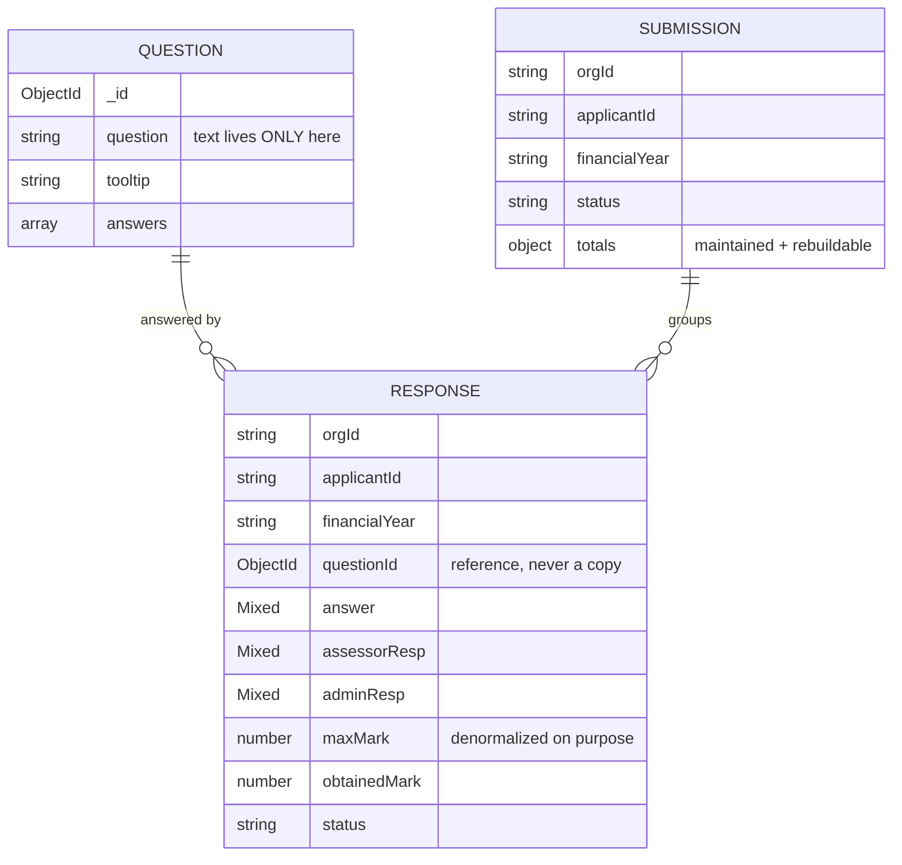

# Questionnaire — Performance & Data Model Design

> **Date:** 2026-08-15
> **Trigger:** "pehle speed aur data calling bahut slow thi"
> **Method:** ECO_EDGE ke actual production dumps naape gaye — guess nahi.

---

## 1. Naapa Hua Diagnosis

### 1.1 Question definitions — `questionnaires`

```
322 questions · 1.56 MB total · avg 5 KB/doc · max 10.7 KB
answer[] tree = 68% of every document
```

Ye apne aap me theek hai. Problem **kaise fetch hote the** us me thi.

### 1.2 Applicant responses — `applicantquestionnaires` ⚠️

```
110 documents · 246 MB file
avg doc  : 2,291 KB   (2.3 MB)
median   : 2,347 KB
p90      : 3,242 KB
MAX      : 3.97 MB    ← MongoDB ka hard limit 16 MB hai
```

**Ek applicant = ek document, jisme uske saare answers hain.**

Ek document ke andar:

| Field | Size | Kya hai |
|---|---|---|
| `answers[]` (102 entries) | 416 KB | asli answers |
| `assessorResp` | 416 KB | **wahi answers array ki doosri poori copy** |

Aur `answers[]` ke andar:

| Field | Total | Note |
|---|---|---|
| `answer` | 262 KB | ✅ asli response data |
| `tooltip` | **72 KB** | ❌ question ka help text, har applicant me copy |
| `question` | 14 KB | ❌ question ka text, copy |
| `description` | 9 KB | ❌ copy |
| `type`, `category`, `section`, `subSection`, `standardAlignment`, `answerType`, `maxMark`, `isMarks`, `isText`, `isUpload`, `questionOrderNo`, `assignmentYear` | ~10 KB | ❌ sab question definition |

`answers[0]` ke keys:
```
questionId, type, assignmentYear, category, section, subSection, status,
assessorComment, adminComment, appli_obtendOption, obtendMark, isMarks,
isText, isUpload, questionOrderNo, assessorResp, maxMark, standardAlignment,
question, description, answerType, assessorSelecedResp, tooltip, answer,
questionIndex
```

**Poori question definition har applicant ke response me copy hai.**

> `tooltip` akela: 72 KB × 110 applicants ≈ **8 MB** ek jaisa help text.
> Size se bhi bura: tooltip edit karne se kisi applicant ko naya text dikhta hi nahi tha — wo apni purani copy padh raha tha.

### 1.3 Iske 4 costs — jo ek doosre ko badhate hain

| # | Cost |
|---|---|
| 1 | **Ek answer padhna = 2.3 MB padhna.** Ek question dikhane wali screen bhi poora applicant kheenchti hai |
| 2 | **Ek answer save karna = 2.3 MB dobara likhna**, aur us dauran us applicant ke *baaki sab* answers par write lock |
| 3 | **Do log alag sections ek saath nahi bhar sakte** — concurrency ki unit poora applicant hai, ek doosre ko overwrite kar dega |
| 4 | **Deewar ki taraf badh raha tha.** 322 questions → 2.3 MB. 16 MB koi tuning threshold nahi hai — wahan write **fail** hone lagti hai |

### 1.4 List screen

`questionnair-list.component.ts` → `getAllQuestionnarie()` → `get-all-questionnaire` (bina filter) → phir **browser me** `filterBySelection()`:

```
322 docs (1.6 MB) download    →    ~106 rows display
```

| FY / Type | Rows | % of download |
|---|---|---|
| 2026 / OEM | 106 | 33% |
| 2026 / Upstream | 85 | 26% |
| 2026 / Upstream-Service | 71 | 22% |
| 2026 / DownStream | 60 | 19% |

Aur ye 14 metadata columns dikhata hai — `answer[]` tree (68% payload) kabhi use hi nahi hota.

---

## 2. Maine Wahi Galti Repeat Kar Di Thi

Ye likhna zaroori hai: mere pehle ke `useCrossTargets` aur `useGridSources` hooks **bilkul yahi kar rahe the** —

```js
questionnaireApi.list({ limit: 200 })   // sab kuch download
  → browser me answer trees walk karke labels nikalo
```

Authoring form ke **har load par**. Theek kar diya (§3.3).

---

## 3. Kya Badla — Question Side

### 3.1 List projection

```js
const LIST_PROJECTION = 'type standardAlignment assessmentYear financialYear
  category section subSection questionOrderNo position maxMark isMarks isText
  isUpload question description brsrCore answerType status version createdBy
  createdAt updatedAt';
```

`answers` tree list se nikal diya → **~68% payload kam**. Jise chahiye wo `?include=answers` bhejta hai.

Plus `.lean()` — 300 nested answer trees ko Mongoose documents me hydrate karna pure overhead tha, koi document method call hota hi nahi.

### 3.2 Server-side filtering + indexes

Ab `financialYear`, `type`, `category`, `section`, `status` sab server par filter hote hain.

```js
{ orgId: 1, financialYear: 1, type: 1,     position: 1 }
{ orgId: 1, financialYear: 1, category: 1, position: 1 }
{ orgId: 1, assessmentYear: 1, category: 1 }
{ orgId: 1, status: 1, position: 1 }
```

**Equality fields pehle, sort field aakhir me** — isse Mongo filter aur sort dono ek hi index se pura kar leta hai, in-memory sort banata hi nahi.

Jaan-boojhkar **nahi** hai: `question` par text index. Search ek regex hai us field par jisme HTML bhara hai — index waise bhi kaam nahi karega. Agar search hot ho jaye to fix hai ek stripped-plaintext field + text index, markup par index nahi.

### 3.3 `GET /formula-sources` — naya endpoint

Formula builder ko chahiye: numeric sub-answers (targets) + grids (denominators). Pehle browser sab kuch download karke walk karta tha.

Ab server walk karta hai, sirf labels bhejta hai — **kuch KB, poori collection nahi**. Do hooks ek me merge ho gaye.

### 3.4 `/meta` — 5 × `distinct` → 1 aggregation + cache

`distinct()` covering index use nahi kar sakta, poori collection scan karta hai. Authoring screen har load par **paanch** maangti thi.

Ab: ek `$group` aggregation, per-org cache, TTL 60s — **aur har write par us org ka entry invalidate**. Sirf TTL kaafi nahi tha: author category add karne ke turant baad usi ko dhoondhta hai.

### 3.5 `POST /reorder`

Drag-drop par sirf **do** documents likhte hain. Poori list renumber karna ek move ko N writes bana deta.

---

## 4. Response Model — Naya Design

> Ye sabse zaroori hissa hai. 2.3 MB documents yahin se aate the, aur renderer isi ke upar banega — isliye pehle theek kiya.

### 4.1 Shape



**Teen collections, teen alag kaam:**

| Collection | Unit | Kyun alag |
|---|---|---|
| `QuestionnaireQuestion` | 1 question | Question text **sirf yahan** |
| `QuestionnaireResponse` | **1 applicant × 1 question × 1 saal** | Read/write utna hi jitna badla |
| `QuestionnaireSubmission` | 1 applicant × 1 saal — **sirf header** | "Submit hua kya?" poochne ke liye 2.3 MB nahi padhna |

### 4.2 Purana vs naya

| | Purana | Naya |
|---|---|---|
| Document ki unit | 1 applicant (sab answers) | 1 answer |
| Avg doc size | **2,291 KB** | ~2-5 KB |
| Ek answer padhna | 2.3 MB | ~3 KB |
| Ek answer save karna | 2.3 MB rewrite | ~3 KB |
| Concurrency ki unit | poora applicant | ek answer |
| Question text | har applicant me copy | reference |
| `assessorResp` | poore array ki 2nd copy (416 KB) | usi answer ke saath ek field |
| "Submit hua?" | 2.3 MB padho | header doc, ~1 KB |
| Growth | **16 MB wall ki taraf** | ceiling hi nahi — zyada questions = zyada docs |

### 4.3 Ek field jo jaan-boojhkar denormalized hai

`maxMark` — response par copy hota hai. Do wajah:

1. Scorecard ko sau answers par obtained/max chahiye. Har ek ko question se join karke ek number padhna, ek query ko per-row lookup bana deta hai.
2. **Denominator freeze ho jaata hai.** Admin agle saal question ke marks badhaye to pichhle saal ke *published* scores chup-chaap nahi badalne chahiye.

Baaki kuch copy nahi hota.

### 4.4 Indexes

```js
// upsert key — unique. Iske bina double-submit chupchaap doosra answer
// bana deta hai aur scorecard use do baar gin leta hai.
{ orgId, applicantId, financialYear, questionId }  UNIQUE

{ orgId, applicantId, financialYear, status }   // progress + scorecard
{ orgId, financialYear, status, updatedAt }     // assessor ki queue
{ orgId, financialYear, questionId }            // cross-applicant analytics
```

### 4.5 Totals: stored, par rebuildable

200 applicants ka dashboard warna 200 aggregations chalata. Counters write par maintain hote hain — **aur `recomputeTotals` bhi hai**, kyunki sirf increment hone wala counter drift karta hai, aur score me drift tab tak koi nahi pakadta jab tak matter na kar jaye.

---

## 5. Manage Karna Aasan Kaise Rahega

| Rule | Kaise enforce hota hai |
|---|---|
| Question text kabhi copy na ho | Response schema me wo fields hain hi nahi — copy karne ki jagah nahi |
| List kabhi poora tree na bheje | `LIST_PROJECTION` default hai; tree ke liye explicit `?include=answers` |
| Browser kabhi collection walk na kare | `/formula-sources` server par karta hai; wo do hooks delete kar diye |
| Index query pattern se match kare | Equality-first ordering, aur comment me likha hai **kaunsi screen** ye chalati hai |
| Cache stale na rahe | Har write par org-key invalidate, TTL sirf backstop |
| Counter drift na kare | `recomputeTotals` rebuild path |

---

## 6. Abhi Bhi Dhyan Dena (jab renderer banega)

1. **Ek saath sab answers mat bhejna.** Section-wise page karo — `{applicantId, financialYear, section}` par query.
2. **Autosave per-answer ho, per-form nahi.** Naye model me ek answer ka save ~3 KB hai; usi ko form-level bana dena purani problem wapas le aayega.
3. **Scorecard aggregation pipeline se**, documents fetch karke JS me jodkar nahi.
4. **Evidence/upload files kabhi document me embed mat karna** — reference rakhna. Ye wahi galti ka doosra roop hai.

---

## Reference

| Kya | Kahan |
|---|---|
| Question model + indexes | [questionnaire.model.js](../backend/modules/questionnaires/questionnaire.model.js) |
| Projection · lean · cached meta · formula-sources | [questionnaire.service.js](../backend/modules/questionnaires/questionnaire.service.js) |
| **Response model (1 answer = 1 doc)** | [response.model.js](../backend/modules/questionnaires/response.model.js) |
| **Submission header** | [submission.model.js](../backend/modules/questionnaires/submission.model.js) |
| Single lean sources hook | [useFormulaSources.js](../frontend-react/src/features/questionnaire/hooks/useFormulaSources.js) |
