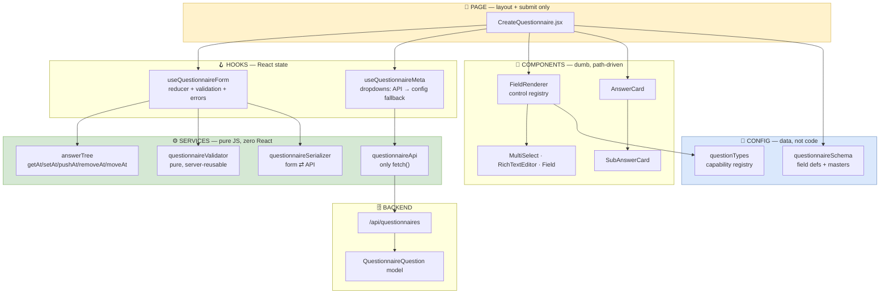

# Questionnaire System — Angular (ECO_EDGE) → React Migration Plan

> **Source analysed:** `d:\Brijesh Kr. Verma\ECO_EDGE` (Angular 17 standalone components)
> **Target:** `d:\Brijesh Kr. Verma\Test\frontend-react` (React 18 + Vite + Tailwind)
> **Delivered in this round:** Create Questionnaire page + service/hook foundation + working backend
> **Date:** 2026-08-15

---

## 1. Deep Dive — ECO_EDGE ka Questionnaire System

### 1.1 Kya-kya mila

| Component | Kaam | Lines |
|-----------|------|-------|
| `add-questionnaire` | **Create Questionnaire** — question author karne ki screen | 233 TS + 398 HTML |
| `questionnair-list` (masters) | List + inline edit | 374 TS + 228 HTML |
| `questionnaire-form` | Applicant ke liye render + fill | — |
| `assessor-questionnaire-view` | Assessor ka marking view | — |
| `applicant-questionnaire-answer-view` | Read-only answer view | — |
| `questionnaire.service.ts` | Scoring calculation | 337 |
| `Backend/models/Questionnaire.js` | Mongoose schema | 121 |
| `Backend/scoring/rule-engines.js` | Naya rule engine (WIP) | — |

### 1.2 Data model (ECO)

```
Questionnaire (1 document = 1 QUESTION, poora questionnaire nahi)
├── type[]              OEM / Upstream / DownStream
├── assignmentYear      assessment year
├── category            Decarbonization / Circularity / ...
├── section / subSection
├── questionOrderNo, position
├── maxMark, isMarks / isText / isUpload
├── question            HTML (rich text)
├── description, tooltip, brsrCore
├── answerType          RadioButton | CheckBox | Text | Upload | Grid
├── state               DRAFT | LOCKED | SUPERSEDED
├── scoringRule         { engine, config }   ← naya, abhi adopt ho raha hai
└── answer[]
    ├── answerLabel, sortOrder, score
    ├── assessorOption[]  (Mixed)
    ├── subAnswer: 'yes'|'no', subAnswerType
    └── subanswar[]  (Mixed)
        └── subAnswerLabel, subscore, gridLabel, grid.gridValue[]
```

**Design smart hai:** ek document = ek question. Isse question versioning, reorder, aur reuse across years easy ho jaata hai. Ye maine **as-is rakha hai**.

### 1.3 Create Questionnaire page ka exact UX

```
┌──────────────────────────────────────────────────────────────────┐
│  Create Questionnaire                              [ SUBMIT ]    │  ← header, bottom border
├──────────────┬───────────────────────────────────────────────────┤
│ Basic        │  Type *              [ multi-select chips     ▾ ]  │
│ Information  │  ┌────────────────────┬──────────────────────┐    │
│              │  │ Assesment Year *   │ Category *           │    │
│ Enter        │  ├────────────────────┼──────────────────────┤    │
│ questionnaire│  │ Section            │ Sub-Section          │    │
│ detail here  │  ├────────────────────┼──────────────────────┤    │
│              │  │ Question Oder No * │ Max Marks            │    │
│  (col-md-2)  │  └────────────────────┴──────────────────────┘    │
│              │  Question *          [ rich text editor       ]   │
│              │  Description         [ textarea               ]   │
│              │  Answer Type         [ select                ▾]   │
│              │                              [ + Add Answer ]     │
│              │  ╭─── answer card (bg #0000ff08) ─────────────╮   │
│              │  │ Answer Label                               │   │
│              │  │ Sort Order        │ Score                  │   │
│              │  │ Sub Answer  ( ) Yes  ( ) No                │   │
│              │  │  ╭── sub-answer block (if Yes) ─────────╮  │   │
│              │  │  │              [ + Add Answer ]        │  │   │
│              │  │  │ Sub Answer Type    [ select      ▾]  │  │   │
│              │  │  │ Answer Label                        │  │   │
│              │  │  │ Score │ Grid label │ Remove [ − ]    │  │   │
│              │  │  ╰─────────────────────────────────────╯  │   │
│              │  │                              [ − ]        │   │
│              │  ╰────────────────────────────────────────────╯   │
│              │  ──────────────────────────────────────────────   │
└──────────────┴───────────────────────────────────────────────────┘
```

**Design tokens:** heading `#002850`, muted `#7c7d7e`, answer card `#0000ff08` + radius 8px, remove button `#dc3545`.

### 1.4 ⚠️ Jo problems mile (aur maine kyun repeat nahi kiya)

| # | ECO me problem | Asar | Mera fix |
|---|---------------|------|---------|
| 1 | **Hardcoded question IDs** — `questionnaire.service.ts` me `if (answer.questionId === '682c4abb485482741b9ce9f6')` jaisi **10+ jagah** | Naya rule = developer + deploy. Question delete hua to rule orphan | Scoring **data** hai, code nahi — `scoringRule: { engine, config }` |
| 2 | **2-level nesting hardcoded** — `skills()`, `subanswar(i)`, `addSubAnswer(i)`, `removeSubSkill(i,j)` — har level ka apna method | 3rd level chahiye to poora naya method-set + template | Path-based `setAt(['answers',0,'subAnswers',1,'score'])` — **koi bhi depth** |
| 3 | **Dropdowns component me hardcoded** — categories, types, 1..30 order numbers literal array | Nayi category = code change | `useQuestionnaireMeta` — API se, config fallback ke saath |
| 4 | **Type strings 5 jagah duplicate** — component, scoring service, render, assessor view | 6th type add kiya, ek jagah bhool gaye → render hoga par score nahi | **Ek registry** — `ANSWER_TYPES` capability flags ke saath |
| 5 | **Naming**: `devloperform`, `addskill()`, `subanswar`, `obtendMark` | Nayi team ko padhne me time | Clean naming; serializer legacy `subanswar` bhi accept karta hai |
| 6 | **Validation UI me bikhri hui** — 30+ inline `@if` blocks HTML me | Server pe reuse nahi ho sakti | Pure `validateQuestionnaire()` — server pe bhi chal sakti hai |
| 7 | Option-less RadioButton save ho jaata tha | Applicant ko blank question milta tha | Validator block karta hai |

> **Sabse bada takeaway:** ECO ka apna `rule-engines.js` doc kehta hai — 40 hardcoded rules me se **35 me sirf DATA tha**, logic sirf 5 me. Wahi galti dobara nahi karni.

---

## 2. Target Architecture (React)



### Layer rules (jo maine follow kiye)

| Layer | Import kar sakta hai | React import? | Kyun |
|-------|---------------------|--------------|------|
| `config/` | kuch nahi | ❌ | Pure data — server bhi import kar sakta hai |
| `services/` | config | ❌ | Testable without rendering; Node me chal sakta hai |
| `hooks/` | services, config | ✅ | React state binding, business logic nahi |
| `components/` | config only | ✅ | Dumb — sirf props |
| `pages/` | sab | ✅ | Layout + submit, aur kuch nahi |

**Rule:** koi component `fetch` nahi karta. Koi service `useState` nahi karta.

---

## 3. Jo Abhi Deliver Hua Hai

### 3.1 Files

| File | Lines | Kaam |
|------|-------|------|
| **Config** | | |
| [config/questionTypes.js](../frontend-react/src/features/questionnaire/config/questionTypes.js) | 78 | Answer type registry + capability flags |
| [config/questionnaireSchema.js](../frontend-react/src/features/questionnaire/config/questionnaireSchema.js) | 108 | Field definitions + masters + factories |
| **Services (pure)** | | |
| [services/answerTree.js](../frontend-react/src/features/questionnaire/services/answerTree.js) | 95 | Immutable path ops — **any depth** |
| [services/gridModel.js](../frontend-react/src/features/questionnaire/services/gridModel.js) | 300 | **Grid ops + stored-shape translation + formula parser/evaluator** |
| [services/questionnaireValidator.js](../frontend-react/src/features/questionnaire/services/questionnaireValidator.js) | 105 | Pure validation + score summary |
| [services/questionnaireSerializer.js](../frontend-react/src/features/questionnaire/services/questionnaireSerializer.js) | 100 | `toPayload` / `toForm` |
| [services/questionnaireApi.js](../frontend-react/src/features/questionnaire/services/questionnaireApi.js) | 60 | Transport only |
| **Hooks** | | |
| [hooks/useQuestionnaireForm.js](../frontend-react/src/features/questionnaire/hooks/useQuestionnaireForm.js) | 175 | Reducer form engine |
| [hooks/useQuestionnaireMeta.js](../frontend-react/src/features/questionnaire/hooks/useQuestionnaireMeta.js) | 55 | Dynamic dropdowns |
| **Components** | | |
| [components/Field.jsx](../frontend-react/src/features/questionnaire/components/Field.jsx) | 40 | Label + required + error chrome |
| [components/FieldRenderer.jsx](../frontend-react/src/features/questionnaire/components/FieldRenderer.jsx) | 130 | Control registry |
| [components/MultiSelect.jsx](../frontend-react/src/features/questionnaire/components/MultiSelect.jsx) | 140 | ng-select replacement |
| [components/RichTextEditor.jsx](../frontend-react/src/features/questionnaire/components/RichTextEditor.jsx) | 125 | angular-editor replacement, **zero deps** |
| [components/AnswerCard.jsx](../frontend-react/src/features/questionnaire/components/AnswerCard.jsx) | 210 | Answer option + marking + nested block |
| [components/SubAnswerCard.jsx](../frontend-react/src/features/questionnaire/components/SubAnswerCard.jsx) | 180 | Sub-answer row + type + input mode + grid |
| [components/GridBuilder.jsx](../frontend-react/src/features/questionnaire/components/GridBuilder.jsx) | 330 | **Table builder + formulas + per-row marking** |
| [components/AssessorOptionEditor.jsx](../frontend-react/src/features/questionnaire/components/AssessorOptionEditor.jsx) | 215 | **Assessor marking, 2 levels** |
| [components/CollapsibleSection.jsx](../frontend-react/src/features/questionnaire/components/CollapsibleSection.jsx) | 45 | Optional blocks, closed by default |
| **Page** | | |
| [pages/CreateQuestionnaire.jsx](../frontend-react/src/features/questionnaire/pages/CreateQuestionnaire.jsx) | 220 | The screen |
| **Backend** | | |
| [questionnaire.model.js](../backend/modules/questionnaires/questionnaire.model.js) | 75 | Mongoose schema |
| [questionnaire.service.js](../backend/modules/questionnaires/questionnaire.service.js) | 100 | CRUD + `/meta` |
| [questionnaire.controller.js](../backend/modules/questionnaires/questionnaire.controller.js) | 33 | Thin controllers |
| [questionnaire.routes.js](../backend/modules/questionnaires/questionnaire.routes.js) | 68 | Zod + RBAC + audit trail |

### 3.2 Wiring

- `server.js` → `/api/questionnaires` mounted
- `App.jsx` → route `/questionnaire-create`
- `Sidebar.jsx` → "Create Questionnaire" under Audit Lifecycle
- `AuthContext.jsx` → `API_MODULE_ROLES.questionnaires` + `NAV_ITEM_MODULE`
- `tests/unit/rbac-parity.test.js` → naya module parity check me add

### 3.3 Verified

```
✓ 169 unit tests pass  (146 existing + 23 naye authoring tests)
✓ vite build clean — 125 modules
✓ backend routes module loads
```

Naye tests ([tests/unit/questionnaire-authoring.test.js](../tests/unit/questionnaire-authoring.test.js)) —
sabse risky logic ko pin karte hain:
- Grid stored-shape round trip (coordinate keys, cell types, assessor options)
- Column insert par renumbering
- Formula parse / toString / evaluate / out-of-range detection
- `inputMode` ⇄ 3 booleans
- Legacy document read (`subanswar`, `answer`, `assignmentYear`, string `type`)
- Sub-options ko alternatives maanna, sum nahi

> ⚠️ **Note:** ye page **BulkInvite jaisa mock nahi hai** — `POST /api/questionnaires` real endpoint hit karta hai aur MongoDB me save karta hai. Mongo band ho to error dikhega, jhoota success nahi.

---

## 3.5 Field Coverage Audit — Round 1 me kya chhoot gaya tha

Pehla version sirf `add-questionnaire.component` se banaya tha. Wo ECO ka **sabse simple surface** hai — stored document isse kaafi bada hai. Ye raha poora audit:

### Question level

| Field | ECO Create page | Round 1 | **Ab** |
|-------|:---------------:|:-------:|:------:|
| `type[]` | ✅ | ✅ | ✅ |
| `assignmentYear` | ✅ | ✅ | ✅ |
| `category` · `section` · `subSection` | ✅ | ✅ | ✅ |
| `questionOrderNo` | ✅ | ✅ | ✅ |
| `maxMark` | ✅ | ✅ | ✅ |
| `question` · `description` | ✅ | ✅ | ✅ |
| `answerType` | ✅ (5 types) | ✅ (5) | ✅ **(6 — `Button` bhi)** |
| `financialYear` | ❌ | ❌ | ✅ |
| `position` | ❌ | ❌ | ✅ |
| `tooltip` | ❌ | ❌ | ✅ |
| `brsrCore` | ❌ | ❌ | ✅ |
| `standardAlignment[]` | ❌ | ❌ | ✅ |
| `isMarks` · `isText` · `isUpload` | ❌ | ⚠️ auto-derived | ✅ **author toggle** |

### Answer level

| Field | ECO | R1 | **Ab** |
|-------|:---:|:--:|:------:|
| `answerLabel` · `sortOrder` · `score` | ✅ | ✅ | ✅ |
| `subAnswer` yes/no · `subAnswerType` | ✅ | ✅ | ✅ |
| `displayLabel` | ❌ | ❌ | ✅ |
| `assessorOptionType` | ❌ | ❌ | ✅ |
| `assessorGuidence` | ❌ | ❌ | ✅ |
| **`assessorOption[]`** | ❌ | ❌ | ✅ |
| └ `option` · `marks` · `marksnotapplicable` | ❌ | ❌ | ✅ |
| └ **`subOption[]`** (2nd marking level) | ❌ | ❌ | ✅ |

### Sub-answer level

| Field | ECO | R1 | **Ab** |
|-------|:---:|:--:|:------:|
| `subAnswerLabel` · `subscore` · `gridLabel` | ✅ | ✅ | ✅ |
| **`subAnswerTypes`** (per-row type) | ❌ | ❌ | ✅ |
| `isTypeText` · `isTypeNumericText` · `isUploadText` | ❌ | ❌ | ✅ (ek `inputMode` choice) |
| `isDisabled` | ❌ | ❌ | ✅ |
| `flag` | ❌ | ❌ | ✅ |
| `assessorOption[]` + type + guidance | ❌ | ❌ | ✅ |
| **`grid` (rows/columns/cells)** | ❌ | ❌ | ✅ |
| **`gridFormulas[]`** | ❌ | ❌ | ✅ |

> **99 stored sub-answers Grid use karte hain** — aur ECO me unhe banane ka koi UI tha hi nahi. Grid sirf MongoDB me haath se likhe ja sakte the.

### 3 badi cheezein jo ab bani hain

#### 1. Grid Builder
Stored shape har cell ko **concatenated coordinates** se key karta hai:
```json
[ { "00": "Name of the Policy",
    "01": { "val": "Available (Y/N)", "type": "text" } },
  { "10": { "val": "Code of conduct", "type": "text" },
    "11": { "val": "", "type": "dropdown" },
    "assessorOption": [ ... ] } ]
```
`"11"` = row 1, column 1. Ek column insert karo to **dayin taraf ke har cell ki key badal jaati hai** — isi liye ise haath se edit karna practically impossible tha.

Editor ab normal `{ columns, rows }` model par kaam karta hai; [gridModel.js](../frontend-react/src/features/questionnaire/services/gridModel.js) boundary par convert karta hai. **Stored format bilkul nahi badla** — 23 unit tests isi ko pin karte hain.

#### 2. Assessor marking scheme
`assessorOption` ~⅓ stored answers par hai aur wahi asli marks carry karta hai. Author nahi kar sakte the → marks seedhe DB me likhe jaate the → scoring service me `if (questionId === '682d…')` branches banane pade.

Ab do level (option + subOption), `marksnotapplicable` ke saath — jo zero marks se alag hai: wo question ko **denominator se hi nikal deta hai** ("ye vendor par lagu nahi hota", bina penalty ke).

#### 3. Grid formulas — click-to-build popup

> **Round 2 correction:** pehle maine ise ek **text input** banaya tha (`(R2C1 / R1C1) * 100` type karo). Wo galat tha. ECO me `add-questionnaire/form-type-components/form-grid/` + `grid-formula-dialog/` hai — poora **click-to-build popup**. Wo folder maine pehle scan me miss kar diya tha.

**Asli UX (ab replicate kiya hua) — Excel wala order:**
```
R4C4 pe click   →  "R4C4 = "
R1C1 pe click   →  "R4C4 = R1C1"
+     pe click  →  "R4C4 = R1C1 +"
R2C4 pe click   →  "R4C4 = R1C1 + R2C4"
Save
```
Target **pehle**, formula baad me. Ulta (pehle formula, aakhir me "=") isliye nahi ki tab aakhir tak pata hi nahi chalta ki kaunsa cell bhar rahe ho.

**`+ Add Calc` cell marking** — cell ke type dropdown me hi ek option hai. Choose karte hi dropdown wapas apne asli type pe chala jaata hai, sirf `isCalc` flag toggle hota hai, aur cell par `fx R2C1` tag aa jaata hai. Popup me **sirf marked cells clickable** hote hain — warna 8×5 table me har cell target hai, aur label column / header row (jo kabhi calculate nahi hote) sabse aasani se galti se click ho jaate hain.

**4 token types:**
| Token | Matlab |
|---|---|
| `{cell:{row,col}}` | isi grid ka cell |
| `{sub:{index}}` | grid ke **bahar** ka sibling input |
| `{op}` | `+ - * / ( )` |
| `{num}` | constant |

`sub` token kyun: "Total water use" me water-utilisation % = grid row ÷ **"Consent to operate (KL)"** — jo ek checkbox se khulne wala input hai, grid me hai hi nahi.

**Cross-question target** — kuch calculations ka nateeja doosre question me jaata hai (energy ka "Renewable %" → renewable-sources question ka field). ECO me ye question ki **position** pe hardcoded tha (`i == 9`, `answers.at(10)`) — beech me ek question add karo to galat jagah likhne lagta tha. Ab document id se target hota hai, isliye reorder se toota nahi.

**Div-by-zero → `null`, `0` nahi.** Adha bhara grid normal state hai; percentage cell me confident `0` likhna ek asli jawab jaisa padhta hai, khaali cell nahi. `null` propagate hota hai.

Tokens store hote hain, text nahi — DB se aayi koi cheez kabhi execute nahi hoti. Backend zod schema me `op` par strict enum hai, aur schema `passthrough` **nahi** hai — yahi guarantee enforce karta hai.

Validator pakadta hai: table ke bahar ka cell, khud ko calculate karna, do formula ek hi cell par, dangling operator, unbalanced brackets, aur galat `S<n>` reference.

#### 4. Popup ka doosra tab — Assessor validation (trend rule) ✅

Pehla tab cell bharta hai. Ye tab **koi cell value deta hi nahi** — ye figures padh ke tay karta hai ki **assessor ka kaunsa option select hoga**. Yahi wajah hai ki ye formula list ka hissa nahi, alag tab hai: nateeja kahin aur jaata hai.

**Kya replace karta hai:** source system me ek hi algorithm **10 baar copy-paste** tha. Har copy me sirf do cheezein alag thi — kaunsi grid row padhni hai, aur denominator kis question se aata hai. Baaki sab same:

```
intensity(saal)  = numerator(saal) / denominator(saal)
pctChange        = (intensity(aakhri) − intensity(pehla)) / intensity(pehla) × 100
band(pctChange)  → kaunsa assessorOption select hoga
```

**5 steps:**
| # | Step | Kya karta hai |
|---|------|--------------|
| 1 | Kaunsi row measure ho rahi hai | Row + year columns click karke chuno; option kisi **doosri** row pe dikhana ho to wo bhi |
| 2 | Kis se divide karna hai | Doosre question ka grid (revenue/production) + uski row + years |
| 3 | Rule kya nikalta hai | Formula text + **live preview table** (numerator / denominator / intensity per saal) + result + warnings |
| 4 | Kaunsa result kaunsa option chunega | Bands table: from% / to% / option / marks |
| 5 | Assessor disagree kar sakta hai? | Override toggle |

**Start state** do preconditions dikhata hai (denominator grid mila? assessor options hain?) — sirf button disable karne se author atak jaata hai, isliye dono ki halat + wajah dikhti hai.

##### 3 purane bugs jo maine jaan-boojhkar repeat nahi kiye

| # | Purana code | Nateeja | Ab |
|---|------------|---------|-----|
| 1 | `> 5` / `< 5` / `< -5` | Bilkul **5 ya −5** pe koi condition sachi nahi hoti thi → company ko **chup-chaap zero marks** | Lower edge inclusive, upper exclusive. `validateBands()` gap **aur** overlap dono pakadta hai — aisa band table save hi nahi ho sakta |
| 2 | `if (intensityY1 \|\| intensityY2)` | Intensity **0** (sabse achha result) ko "data hi nahi hai" maan leta tha | Har jagah explicit `null` check |
| 3 | `cell(col12) \|\| cell(col13)` | Ek saal khaali ho to **agle saal ka value utha leta tha** — kis-kis saal ki tulna ho rahi hai wo chup-chaap badal jaata tha | Zaroori saal khaali ho to rule **skip** hota hai, warning ke saath |

Teeno ke liye test hain. Backend zod schema me bands `.strict()` hain — hand-written request se bhi gap wala table store nahi ho sakta.

---

## 4. Angular → React Mapping

| Angular | React | Note |
|---------|-------|------|
| `FormBuilder.group()` | `useQuestionnaireForm` reducer | Named actions → undo/autosave later |
| `FormArray` + `skills()` | `answerTree` path ops | Any depth, not 2 |
| `Validators.required` | `validateQuestionnaire()` | Pure, server-reusable |
| 30+ inline `@if` error blocks | `errorFor(path)` | Ek flat map |
| `<ng-select>` | `MultiSelect.jsx` | Single + multi, ek component |
| `<angular-editor>` | `RichTextEditor.jsx` | Zero dependency |
| `mat-radio-group` | `YesNoRadio` in AnswerCard | Same bordered look |
| `ApiService.post()` | `questionnaireApi.create()` | Error unwrap ek jagah |
| `LoaderService` | local `saving` state | Global loader ki zarurat nahi |
| `AlertService.successSnackBar` | `useToast()` | Project ka existing toast |

---

## 5. Naya Type / Field Add Karna — 3 Examples

### Example 1: Naya answer type "Dropdown"
`config/questionTypes.js` me **ek object**:
```js
{ id: 'Dropdown', label: 'Dropdown', hint: 'Pick one from a long list',
  hasOptions: true, allowsSubAnswer: true, allowsScore: true, isGrid: false,
  captures: 'single' },
```
Bas. Select me aa jayega, options block khul jayega, validator apne aap enforce karega.

### Example 2: Naya field "Tooltip"
`config/questionnaireSchema.js` ke `BASIC_FIELDS` me:
```js
{ name: 'tooltip', label: 'Tooltip', control: 'richtext', span: 12 },
```
Plus serializer me ek line, model me ek field. Page ki JSX **chhui nahi jaati**.

### Example 3: Naya control type "Color picker"
`components/FieldRenderer.jsx` ke `CONTROLS` map me ek entry. Sab fields ko mil jaata hai.

---

## 6. Roadmap — Full Dynamic Questionnaire Management

```mermaid
flowchart LR
    subgraph P1["✅ Phase 1 — DONE"]
        A1[Create page]
        A2[Service/hook foundation]
        A3[Backend CRUD + meta]
    end
    subgraph P2["Phase 2 — 1 week"]
        B1[List + filters]
        B2[Edit page — toForm reuse]
        B3[Duplicate / delete]
        B4[Draft autosave]
    end
    subgraph P3["Phase 3 — 1.5 weeks"]
        C1[Scoring rule editor]
        C2[Rule engine registry]
        C3[Live score preview]
    end
    subgraph P4["Phase 4 — 1 week"]
        D1[Publish / lock / version]
        D2[Assessment year rollover]
        D3[Bulk import from JSON]
    end
    subgraph P5["Phase 5 — 1.5 weeks"]
        E1[Respondent renderer]
        E2[Assessor marking view]
        E3[Conditional visibility]
    end
    P1 --> P2 --> P3 --> P4 --> P5
    style P1 fill:#d5e8d4,stroke:#82b366
```



### Phase 2 — Management (1 week)
```
□ QuestionnaireList page — filter by year/category/section/status
□ Edit page — same components, `useQuestionnaireForm(doc)` + toForm
□ Duplicate button (reset ids, version+1)
□ useAutoSave hook — localStorage draft, tab band hone par bacha rahe
□ Reorder answers — moveAnswer() already hook me hai, sirf UI chahiye
```

### Phase 3 — Dynamic Scoring (1.5 weeks) ⭐ **sabse important**
```
□ config/scoringEngines.js registry:
    fixed        → constant marks
    optionSum    → selected options ka sum (default)
    numericBand  → numeric input → band table
    gridLookup   → grid cell → marks
    passthrough  → user ka number hi score
□ ScoringRuleEditor.jsx — engine pick + config form
□ evaluateScore(rule, response) — pure fn, frontend preview + backend truth
□ Live preview: author dekh sake ki sample answer pe kitne marks aayenge
```
> Yahi wo cheez hai jo ECO me `if (questionId === '682c...')` thi. Isko data bana dene se **admin bina developer ke** koi bhi rule laga sakta hai.

### Phase 4 — Lifecycle (1 week)
```
□ Draft → Published → Archived transitions
□ Published question edit → naya version, purana SUPERSEDED
   (live responses invalidate na hon)
□ Assessment year rollover — pichle saal ke questions clone
□ Import: ECO ke 2.6 MB JSON dumps ko toForm() se ingest
```

### Phase 5 — Runtime (1.5 weeks)
```
□ QuestionnaireRenderer — same ANSWER_TYPES registry se render
□ Response capture + evidence attach
□ Assessor view — marking + guidance
□ Conditional visibility (dependsOn) — Test project ke template model me already hai
```

**Total: ~5 weeks Phase 1 ke baad.**

---

## 7. Ek Decision Jo Aapko Lena Hai

Project me **do questionnaire models** ab maujood hain:

| | `/api/assessments/templates` (purana) | `/api/questionnaires` (naya) |
|---|---|---|
| Shape | 1 doc = poora template, `sections[].questions[]` | 1 doc = 1 question |
| Question types | 21 | 5 (ECO wale) |
| Conditional logic | `dependsOn` hai | abhi nahi |
| Scoring | `scoring.service.js` | Phase 3 |
| Nesting | flat questions | **nested answers + sub-answers** |
| ECO parity | ❌ | ✅ |

**Meri sifarish: naye `/api/questionnaires` par converge karo**, aur template model ko Phase 4 me ussi me merge kar do. Wajah:
- ECO ka real data (2.6 MB, hazaaron questions) is shape me hai — migration free
- Per-question document versioning aur reuse allow karta hai, template model nahi
- `dependsOn` aur 21 types ko naye model me **add** karna easy hai; nested sub-answers ko purane flat model me daalna nahi

Agar aap dono rakhna chahte ho to bata dena — main ek adapter layer bana dunga, par do parallel systems long-term me wahi drift banayenge jo ECO me hua.

---

## 8. Try Karne Ke Liye

```bash
# terminal 1
cd "d:\Brijesh Kr. Verma\Test"
npm run dev

# terminal 2
cd "d:\Brijesh Kr. Verma\Test\frontend-react"
npm run dev
```

Sidebar → **Audit Lifecycle → Create Questionnaire**, ya seedha `/questionnaire-create`.

**Dekhne layak:**
- **Preview JSON** button — exact payload jo save hoga
- Left column me live **score check** — options total vs Max Marks
- Submit se pehle sab errors ek saath highlight hote hain, pehle nahi
- Sub Answer "No" karo phir "Yes" — typed data wapas aa jaata hai (ECO me chala jaata tha)
